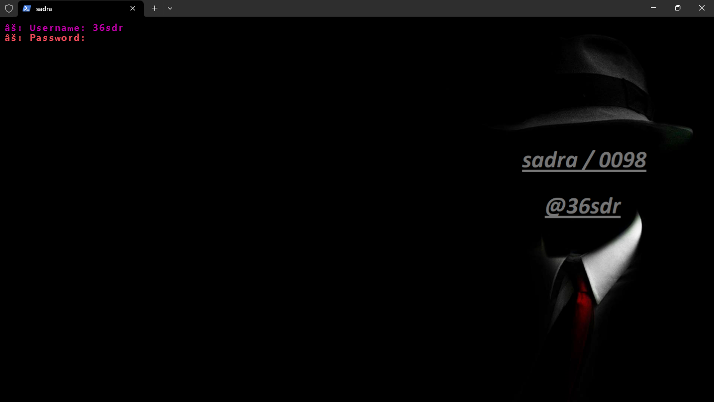
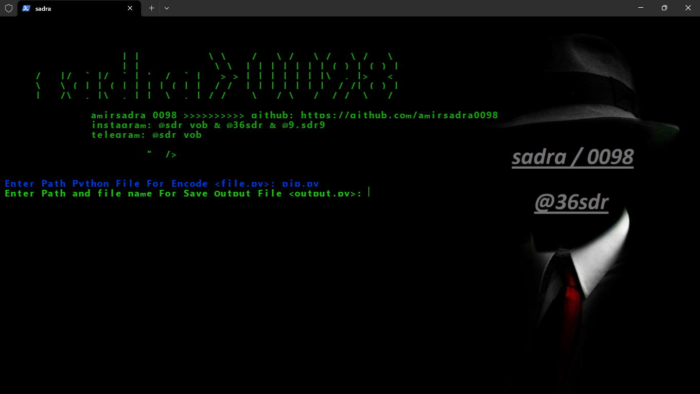

                        _            __      ___   ___   ___   ___  
                       | |           \ \    / _ \ / _ \ / _ \ / _ \ 
          ___  __ _  __| |_ __ __ _   \ \  | | | | | | | (_) | (_) |
         / __|/ _` |/ _` | '__/ _` |   > > | | | | | | |\__, |> _ < 
         \__ \ (_| | (_| | | | (_| |  / /  | |_| | |_| |  / /| (_) |
         |___/\__,_|\__,_|_|  \__,_| /_/    \___/ \___/  /_/  \___/ 
                                                            
                  amirsadra 0098 >>>>>>>>>>
                  instagram: @sdr_vob & @36sdr
                  telegram: @sdr_vob

                           "  />
</p>
<div align="center"> 
  <a href="https://github.com/amirsadra0098/encrypt">
    
  </a>
  <a href="https://www.python.org/">
    
  </a>
  <a href="https://www.jetbrains.com/pycharm/download/#section=windows">
    
  </a>
</div>
<br />

**ONLY DOWNLOAD IT HERE, DO NOT TRUST OTHER PLACES.**

Written by: @sdr_vob (https://github.com/amirsadra0098)
            
            
            
## AMIRSADRA


0098                                                                                                                            
## 🔖 About

We have created this tool that many new people come in the world of pen testing & Ethical Hacking. They do not know much about the basics. So this tool has been created to help them. I hope you share this tool with your new friends.

### Password Tools :
* username : 36sdr
* password : ?????


## 🎨 Tested on
* windows & Termux
* Parrot-Sec 

# ⏳ Installation
**RUN THIS AS ROOT**

```
$ git clone https://github.com/amirsadra0098/encrypt
$ pip install colorama
$ pip install marshal
$ pip install getpass
$ cd encrypt
$ chmod +x *
$ python3 encrypt-file-python.py
$ 
```

# 📸 SCREENSHOT




### SADRA 


